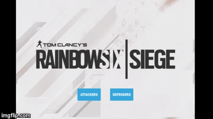
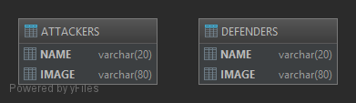

# JPGuiProject  

## Overview  
The program acts as a random character selector focused around the game *"Tom Clancy's Rainbow Six Siege"* by Ubisoft. 
Version is being built around the current active 'operation' within the game, "Grim Sky". The program works through a 
custom designed UI, utilizing a database.

This Java based GUI application is developed by a student of Florida Gulf Coast University for educational purposes. 
Certain assets were provided by Ubisoft Montreal and Ubisoft in accordance with fair use.

## Usage 
On program start, you're presented with a menu showing two buttons, "ATTACKERS" and "DEFENDERS". Pressing either will 
bring you to a side-respective scene where the icons of each operator(attacker or defender depending) are displayed in
the center of the screen.  

  

Pressing the right-most buttons "PICK FOR ME" will select an operator at random via database query, limiting results to 
the selected type (attacker/defender) operator. Pressing these buttons again will refresh the scene with a new, random 
operator.  

## Database Structure and Diagram
The database of the program is created through Apache's embedded Derby database driver.  

  

The database "OperatorData" is broken up into two tables, *ATTACKERS* and *DEFENDERS*. Both tables hold the same structure
and data types, but are differentiated by their contents. As of current build, each table has 21 rows each with 2 elements
(NAME and IMAGE, both of type VARCHAR). *NAME* holds the value of each unique operator's name whilst *IMAGE* holds the
relative path to the image of the respective operator.

## GUI Design Principles
Aesthetically, this program is styled with CSS around a minimalistic design using a simple, but bold color scheme. The 
alignment of buttons/nodes/images was based symmetrically on each other in the scene. For the in-between scene of choosing 
an operator type and selecting a random operator, the operator icon images had edited to better reflect this symmetry.   

The background remains constant across each scene with buttons and labels retaining a single scheme of light blue(#36a9e0) 
background with white text(#fff) which allows for contrast and clarity between the white, cream, and grey background. 
Buttons are clearly labeled to reflect which scene they go to or what action they perform. This scheme set up for the 
program is coordinated with the color scheme of buttons within the official game of *"Tom Clancy's Rainbow Six Siege."*  

The tradeoff of this program is its small initial release state. Options for customizability are not currently available, but 
remain a topic of interest for future development.

## Credits  
Evans, Trevor  
Ubisoft Entertainment SA   
Vanselow, Scott

## License/Copyright
© 2018, Trevor Evans
